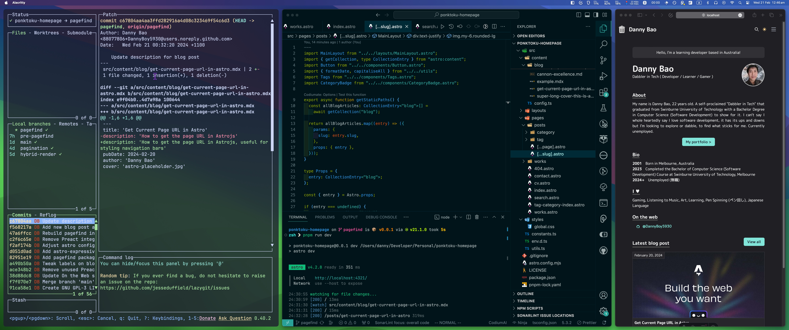

import Link from '../../components/Link.astro';
import Blockquote from '../../components/Blockquote.astro';
export const components = {blockquote: Blockquote, a: Link}

## Tech Stack

- [**Astrojs**](https://astro.build/) - A web framework for content driven websites with hybrid, static & server side rendering
- [**Tailwind CSS**](https://tailwindcss.com/) - Utility-first CSS framework
- [**Flowbite**](https://flowbite.com/) - Tailwind component library
- [**MDX**](https://docs.astro.build/en/guides/integrations-guide/mdx/) - Astrojs/mdx integration
- [**pagefind**](https://pagefind.app/) - Search library for static websites
- [**astro-expressive-code**](https://expressive-code.com/) - Enhanced code blocks in md/mdx posts

## Some Context

I had heard that Astro was a good framework for even beginners but also versatile in capability. It was growing in popularity and at the time Astro had just released version 4.0. So I dived head-first straight in. My goal was to make a portfolio website that also had a blog which I heard Astro is very good for.

I initially had wanted to make something original but gave up the idea and set my goal on emulating another website which sped up development process and gave me bearings on what my website needed during development. It also means I don't have to worry about thinking of a colour scheme.

## The Journey

With the help of the official astro quick start "build a blog" guide and some [other resources](https://www.youtube.com/watch?v=XoIHKO6AkoM) I repurposed what I learned into my own portfolio site with a blog. For the visual design I copied Takuya Matsuyama's website [Takuya Matsuyama - Homepage](https://www.craftz.dog/) and took some ideas from [Florian Lefebvre's](https://florian-lefebvre.dev/) website.

But I decided to switch my website to be static-site generated (SSG), since most of the content are static html pages that don't change I don't really need the full benefits of SSR. The added speed of SSG websites are also a nice bonus.

Related blog posts:
- [Get current page url](get-current-page-url-in-astro)

## My Reflections

- The way I made this particular website, it's not very scalable. The design of this website visually is based of Takuya Matsuyama's website which was spun up together quickly using Chakra UI. I essentially hand re-created Chakra UI's components using Tailwind and Astro which took time (but was at least a learning experience).
	- Later in the development of the website, I figured out how to pass tailwind class strings down to Astro components with Astro's [`class:list`](https://docs.astro.build/en/reference/directives-reference/#classlist) and examples from [florian-lefebvre.dev](https://florian-lefebvre.dev/).

I learned:
- I learned the differences between SSR and SSG. The website was at first server rendered, then hybrid and then converted to static because there's not really any interactive elements (interactive islands). The website is mostly just styled HTML elements with a bit of JavaScript.
- I learned a lot about Astro. 
- My CSS also skills got better because I used Tailwind (even though it was my first time using it). 
- I figured out how a components can be used in a framework (though I kept it simple here, I think it can get more complex in something like React).
- Pushing commits, making branches, creating a branch from an old commit ID, doing these git commands on a day to day basis helps me remember them.

## Possible TODOs

- Use a headless CMS for the blog
- Figure out how to add `ViewTransitions`, without breaking the navigation bar
- Make components more resusable
- Use `@tailwind/typography` plugin and Prose component to style for blog posts and generally make styling cleaner
- Fix the images so on the 'works' page so that they are all the same size